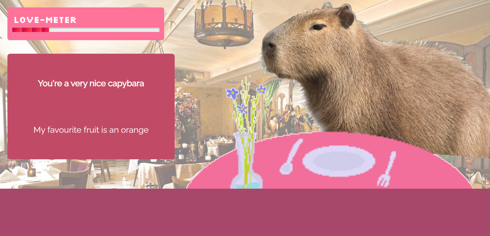
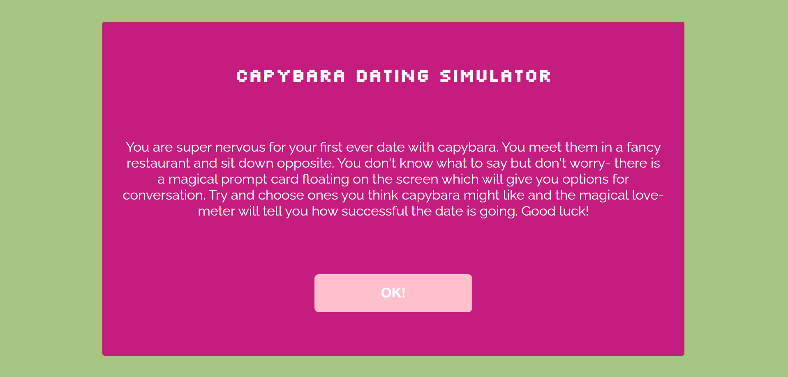
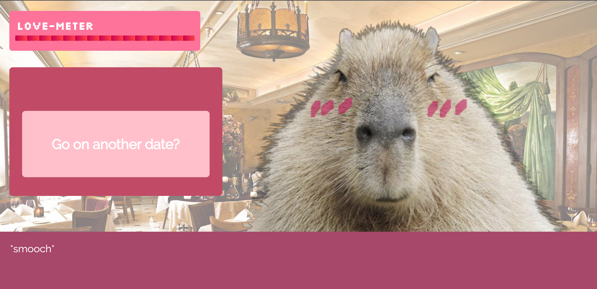

# Capybara Dating Simulator

<h1><a href="https://karinhawk.github.io/game-project/">Play Game</a></h1>

## Table of Contents
- [Brief](#brief)
- [About](#about)
- [Screenshots](#screenshots)
- [Languages](#languages)
- [Code of Note](#code_of_note)

## Brief 

1. Build a fully functioning browser based game using HTML, CSS/SCSS and Javascript
2. Must be a working game
3. Practice using GitHub
4. JS formatted as functions
5. Use event listeners
6. Must work on mobile and browser

## About 

* Interactive dating simulator (with a capybara!) written in Javascript
* Click to generate dialogue choices
* Choose dialogue the capybara likes and the love bar will increase
* Choose dialogue the capybara doesn't like and the love bar will decrease
* Win the game by progressing the love bar to 100
* Lose the game by running out of dialogue options or decreasing the love bar to 0
* Mini easter-eggs sprinkled throughout!

## Screenshots 

## Languages 

* HTML/SCSS (BEM formatting)
* Javascript

## Code of Note 

* Importing and cloning an array of dialogue objectss
* Instructions page which links to main game and vice versa (with a new button) when the game is won/lost
* Typing animation
* handleWin function
* Progress bar styling 